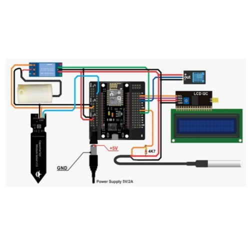
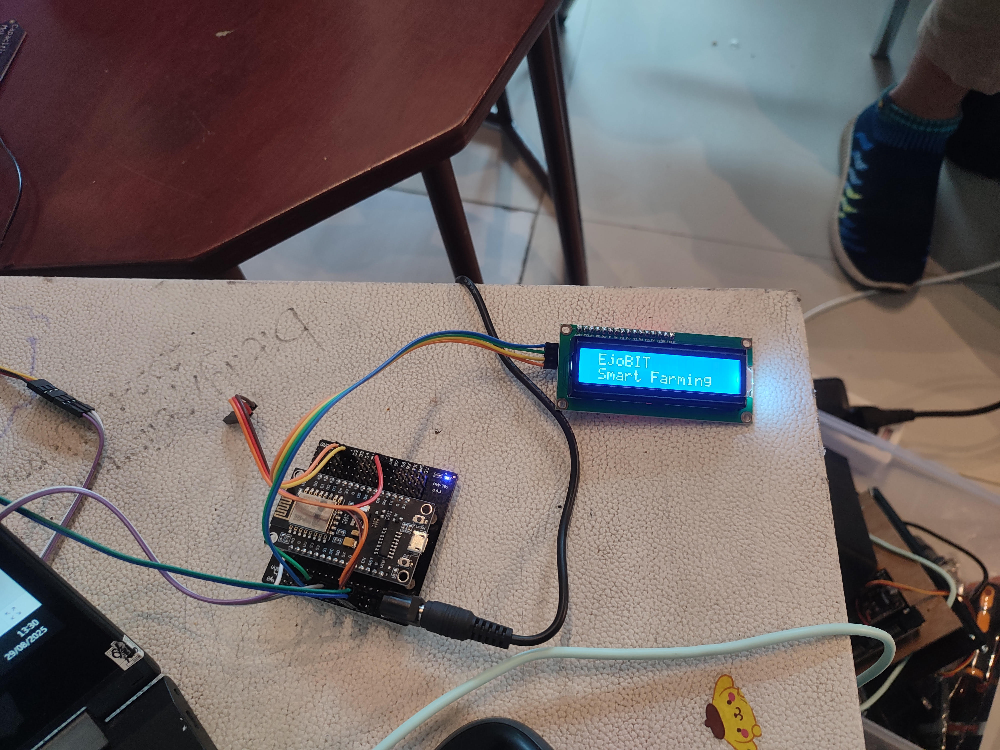

# JD-SLAMETBAKTIMAN-EJOBIT
Live Coding Jagoan Digital 2025

**EjoBIT** adalah solusi IoT berbasis NodeMCU untuk monitoring, kontrol irigasi dan pemupukan secara otomatis pada tanaman, dirancang untuk petani yang menghadapi tantangan iklim seperti kekeringan dan banjir. 

Sistem ini menggunakan sensor kelembaban tanah, sensor NPK, suhu, dan udara untuk meng-otomatisasi pompa air, menampilkan data di LCD, dan terhubung ke aplikasi Blynk untuk kontrol real-time. 

Proyek ini mendukung ekosistem pertanian presisi, dengan potensi menghemat air hingga 30%, efisiensi pupuk dan meningkatkan hasil panen, sejalan dengan SDGs 2 (Zero Hunger) dan 13 (Climate Action).

Insight:
- Jumlah penduduk Indonesia tahun 2023 hampir mencapai 300jt, dengan pertumbuhan rata-rata sebesar 2,8jt per tahun.
- Kebutuhan pangan nasional terus meningkat, sementara lahan pertanian & jumlah petani justru semakin menurun.
- Artinya, "pertanian presisi" saat ini adalah suatu keharusan sebagai solusi dari permasalahan di Indonesia dan dunia.

## Fitur Utama 
- Monitoring real-time kelembaban tanah, suhu tanah, dan kelembaban udara via LCD dan Blynk.
- Kontrol pompa otomatis (berdasarkan setpoint kelembaban) dan manual via aplikasi.
- Desain hemat biaya untuk petani.
- Skalabel untuk mendukung program ketahanan pangan di Banyuwangi.

## Daftar Isi
- [Kebutuhan](#kebutuhan)
- [Instalasi & Setup](#instalasi--setup)
- [Progres Live Coding](#progres-live-coding)
- [Troubleshooting](#troubleshooting)
- [Kontributor](#kontributor)
- [Lisensi](#lisensi)
- [Kontak](#kontak)

## Kebutuhan

### Hardware
| Komponen             | Deskripsi                    | Pin NodeMCU |
|----------------------|------------------------------|-------------|
| NodeMCU ESP8266      | Mikrokontroler utama         | -           |
| Soil Moisture Sensor | Kelembaban tanah             | A0          |
| DHT11                | Kelembaban dan suhu udara    | D3          |
| DS18B20              | Suhu tanah/air               | D5          |
| Relay Module         | Kontrol pompa air            | D6          |
| LCD I2C 16x2         | Display status               | SDA/SCL     |

**Catatan**: Gunakan power supply 5V eksternal untuk stabilitas.

### Software
- **Arduino IDE**: Versi 2.x ([download](<https://www.arduino.cc/en/software>)).
- **Libraries**: Blynk, DallasTemperature, OneWire, DHT sensor, LiquidCrystal_I2C.
- **Blynk App**: iOS/Android, template ID: `TMPL6fjy80emY`, token: `Q9oUo3wiN4FN60JEVAm-nWtfUMFSJnLh`.
- **WiFi**: Koneksi stabil (hotspot/mobile data).

## Instalasi & Setup
1. **Install Arduino IDE**:
   - Download dari [arduino.cc](<https://www.arduino.cc/en/software>).
   - Tambah board ESP8266 di `Preferences` > `Additional Boards Manager URLs` > `http://arduino.esp8266.com/stable/package_esp8266com_index.json`.
   - Install board ESP8266 via Boards Manager.
2. **Install Libraries**:
   - Buka Arduino IDE > `Sketch` > `Include Library` > `Manage Libraries`.
   - Cari dan install: `Blynk`, `DallasTemperature`, `OneWire`, `DHT`, `LiquidCrystal_I2C`
3. **Setup Hardware**:
   - Hubungkan komponen sesuai skema.
     
   - Pastikan pin: Soil Moisture (A0), DHT11 (D3), DS18B20 (D5), Relay (D6), LCD I2C (SDA/SCL).
   - Gunakan power supply 5V eksternal untuk stabilitas.
4. **Setup Blynk**:
   - Daftar di [blynk.io](<https://blynk.io>), buat template dengan ID dan token di atas.
   - Widget akan dikonfigurasi setelah integrasi Blynk selesai.

## Progres dan Live Coding
Proyek ini akan dikembangkan menjadi 4 tahap selama 2 hari, antara lain:
1. **Tahap 1** : Inisialisasi Hardware dan display LCD.
- Inisialisasi NodeMCU, sensor (Soil Moisture, DHT11, DS18B20), relay, dan LCD I2C.
- LCD menampilkan splash screen: "EjoBIT | Smart Farming".
- Kode: Inisialisasi library, pin konfigurasi, dan setup awal.
- Hasil: LCD menyala, hardware siap untuk pembacaan sensor.

     
  
2. **Tahap 2** : Pembacaan sensor dan output ke display LCD.
3. **Tahap 3** : Kontrol pompa otomatis dan manual.
4. **Tahap 4** : Integrasi Blynk untuk monitoring dan kontrol via aplikasi.

## Kontributor
- Slamet Baktiman - Full Stack IoT Developer
